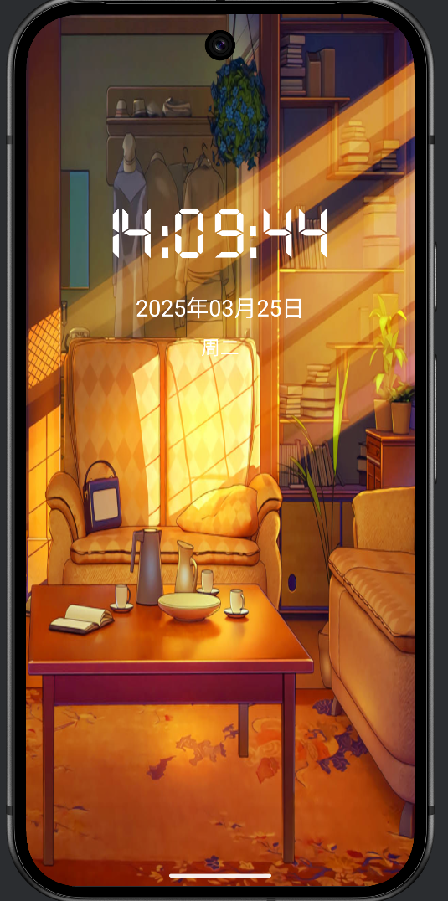

# Android 学习仓库


这个仓库记录了我的Android原生开发学习历程，包含课程作业、练习项目和自学案例。

## 📱 课程作业一：Time Clock 数字时钟

{:height="50%" width="50%"}

一个功能完善的数字时钟应用，实现了：
- 实时时间显示（时分秒）
- 智能背景切换（每4小时更换）
- 电子数字字体显示
- 完整日期信息（年月日+星期）

### 技术亮点
- 使用`Timer`和`Calendar`实现精准计时
- 动态资源加载管理背景图片
- 自定义字体应用
- 响应式UI设计

## 📚 学习路线

### 已完成
1. **基础UI开发**
   - 常用布局(RelativeLayout/LinearLayout)
   - 基础组件使用
   - 资源管理

2. **核心功能实现**
   - 定时任务处理
   - 时间日期处理
   - 动态资源加载

## 🚀 后续计划

这个仓库将持续更新我的Android学习进度，感谢大家的指导！

## 📦 项目结构

```
/AndroidHomework/
├── Time/          # 数字时钟项目
├──UIdemo/         # 前方施工中...
├── screenShoots/  # 项目截图
├── docs/          # 学习笔记
└── ...
```

欢迎关注我的学习历程，也欢迎提出建议！✨
