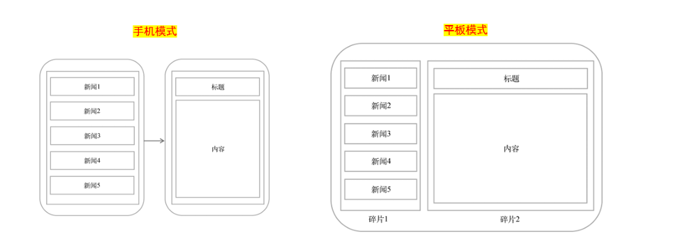

# 📰 新闻 APP 作业报告

## 📑 目录

- [一、作业题目分析](#一作业题目分析)
  - [1.1 作业要求分析](#11-作业要求分析)
  - [1.2 技术选择理由](#12-技术选择理由)
  - [1.3 实现难点](#13-实现难点)
- [二、项目概述](#二项目概述)
- [三、技术实现](#三技术实现)
  - [3.1 项目结构](#31-项目结构)
  - [3.2 关键实现思路](#32-关键实现思路)
  - [3.3 关键代码分析](#33-关键代码分析)
- [四、界面美化实现](#四界面美化实现)
  - [4.1 动画与交互](#41-动画与交互)
  - [4.2 夜间模式支持](#42-夜间模式支持)
- [五、平板模式支持](#五平板模式支持)
  - [5.1 效果展示](#51-效果展示)
- [六、总结与改进方向](#六总结与改进方向)
  - [6.1 项目特色](#61-项目特色)
  - [6.2 未来可扩展](#62-未来可扩展)
- [七、学习小结](#七学习小结)
  - [7.1 技术收获](#71-技术收获)
  - [7.2 开发体会](#72-开发体会)
  - [7.3 未来学习方向](#73-未来学习方向)

---

## 一、作业题目分析

### 1.1 作业要求分析

> 本次作业要求使用 **Activity + Fragment + RecyclerView** 技术实现一个新闻 APP，并支持手机和平板两种显示模式。

**核心技术点：**

- 🧩 **Fragment**：页面模块化，灵活布局
- 🗂️ **RecyclerView**：高效列表展示
- 📱 **屏幕适配**：多设备最佳体验
- 🎨 **UI 美化**：现代化界面设计



### 1.2 技术选择理由

- **Fragment**：灵活界面切换，适合多屏适配
- **RecyclerView**：高效回收复用，性能优于 ListView
- **ConstraintLayout**：灵活高性能布局

### 1.3 实现难点

- 📲 手机/平板模式动态切换
- 🔄 Fragment 通信与生命周期管理
- 🖱️ 列表与详情优雅交互
- 🧑‍🎨 界面美观与一致性

---

## 二、项目概述

本项目基于 **Activity + Fragment + RecyclerView**，实现新闻列表与详情展示，支持手机和平板双模式，界面美观，交互流畅。

---

## 三、技术实现

### 3.1 项目结构

| 组件             | 作用说明                   |
| ---------------- | -------------------------- |
| `MainActivity`   | 主 Activity，Fragment 管理 |
| `NewsFragment`   | 新闻列表 Fragment          |
| `DetailFragment` | 新闻详情 Fragment          |
| `NewsAdapter`    | RecyclerView 适配器        |
| `NewsItem`       | 新闻数据模型               |

### 3.2 关键实现思路

- **Activity** 检测设备类型，动态加载 Fragment
- **RecyclerView** 展示新闻列表，点击跳转详情
- **卡片式布局** 美化新闻项
- **动画与夜间模式** 提升体验

---

### 3.3 关键代码分析

#### MainActivity

- 判断是否为平板模式，动态加载不同布局容器。
- 通过 FragmentManager 实现 Fragment 切换与回退栈管理。

```java
boolean isTabletMode = getResources().getBoolean(R.bool.isTablet);
int containerId = isTabletMode ? R.id.news_list_container : R.id.fragment_container;
getSupportFragmentManager().beginTransaction()
    .replace(containerId, new NewsFragment())
    .commit();
```

#### NewsFragment

- 初始化 RecyclerView，设置适配器和点击事件。
- 根据设备类型，点击新闻项时切换到详情 Fragment。

```java
recyclerView.setLayoutManager(new LinearLayoutManager(getContext()));
adapter = new NewsAdapter(newsItems);
recyclerView.setAdapter(adapter);

adapter.setOnItemClickListener(newsItem -> {
    DetailFragment detailFragment = DetailFragment.newInstance(newsItem.getTitle(), newsItem.getDescription());
    int containerId = isTabletMode ? R.id.news_detail_container : R.id.fragment_container;
    getParentFragmentManager().beginTransaction()
        .replace(containerId, detailFragment)
        .addToBackStack(null)
        .commit();
});
```

#### NewsAdapter

- 采用 ViewHolder 模式高效绑定新闻数据。
- 提供点击回调接口，便于 Fragment 响应点击事件。

```java
public interface OnItemClickListener {
    void onItemClick(NewsItem newsItem);
}
```

---

## 四、界面美化实现

### 4.1 动画与交互

- 列表项添加动画与波纹点击效果，提升交互体验。

  ```java
  recyclerView.setLayoutAnimation(AnimationUtils.loadLayoutAnimation(
      getContext(), R.anim.layout_animation_fall_down));
  ```

### 4.2 夜间模式支持

- 提供 `values-night/colors.xml`，自动适配夜间主题，保护视力。

---

## 五、平板模式支持

- 检测设备类型，平板采用双面板布局，列表与详情并列显示。

  ```xml
  <!-- res/layout-sw600dp/activity_main.xml 片段 -->
  <androidx.fragment.app.FragmentContainerView android:id="@+id/news_list_container" ... />
  <androidx.fragment.app.FragmentContainerView android:id="@+id/news_detail_container" ... />
  ```

### 5.1 效果展示

#### 📱 手机模式

单面板设计，新闻列表与详情通过页面切换展示，充分利用有限屏幕空间。


#### 🖥️ 平板模式

双面板设计，同时展示新闻列表与详情，提升大屏设备使用效率。


---

## 六、总结与改进方向

### 6.1 项目特色

- 📱 响应式设计，自动适配多设备
- 🎨 现代化界面设计
- ⚡ 高效 RecyclerView 列表
- 🌙 夜间模式支持

### 6.2 未来可扩展

- 🌐 网络获取真实新闻
- 🔄 下拉刷新与加载更多
- 🔍 新闻搜索与分类
- ⭐ 用户登录与收藏
- 🌓 夜间模式自动切换

---

## 七、学习小结

本次新闻 APP 开发实践，使我深入理解了 Android 现代化 UI 开发技术栈，收获颇丰。

### 7.1 技术收获

通过本项目，我掌握了以下关键技能：

- **Fragment 管理**：灵活组合界面，实现复杂交互
- **RecyclerView 应用**：高效列表渲染，优化滚动性能
- **响应式布局**：同一代码基础上适配不同设备
- **现代化界面设计**：提升用户体验的界面设计技巧

### 7.2 开发体会

- **模块化思维**：Fragment 使界面更加模块化，便于维护和扩展
- **数据与视图分离**：Adapter 模式有效分离数据和 UI 逻辑
- **设计模式应用**：观察者模式(点击监听)、适配器模式等在实践中的运用
- **细节决定体验**：动画过渡、阴影效果等细节极大提升了应用品质

### 7.3 未来学习方向

- 研究 MVVM 架构在复杂应用中的实践
- 掌握 Material You 设计语言的最新特性

这次实践不仅提升了我的 Android 开发技能，也培养了我对软件架构和用户体验的思考。通过不断迭代和优化，最终实现了一个功能完善、界面美观的新闻应用，为今后的移动应用开发奠定了坚实基础。

---
